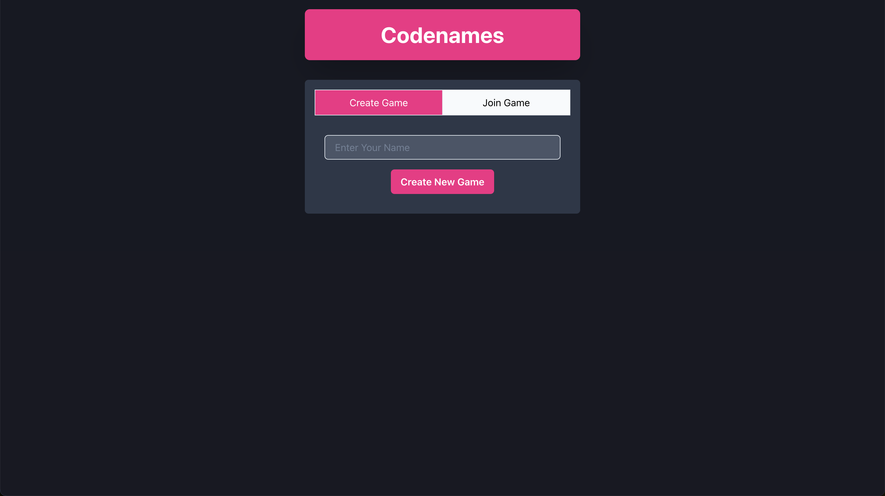
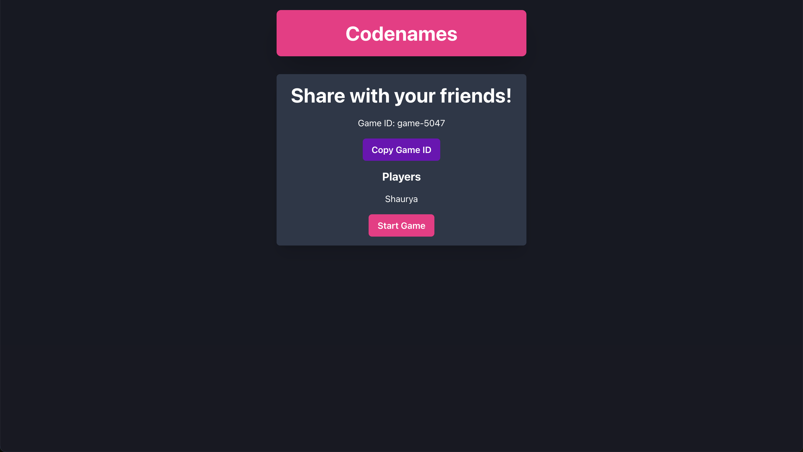
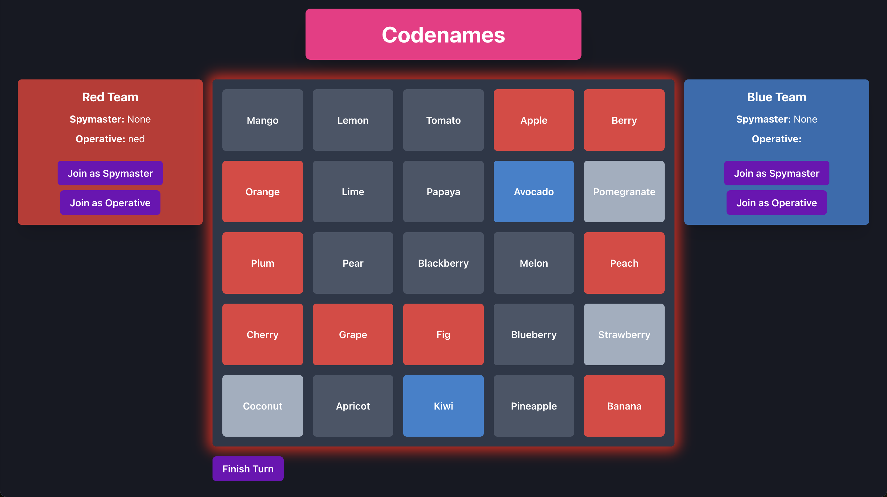

# Codenames - Web-based Game Implementation

Welcome to the Codenames game! This is a web-based version of the popular word-guessing board game. The game is implemented using React and Chakra UI.

## Table of Contents

- [Project Description](#project-description)
- [Features](#features)
- [Technologies Used](#technologies-used)
- [Setup Instructions](#setup-instructions)
- [Game Screenshots](#game-screenshots)
- [Game Rules](#game-rules)
- [Contributing](#contributing)
- [License](#license)

## Project Description

Codenames is a word-guessing game where two teams compete to identify their agents based on one-word clues given by their team's spymaster. This web version aims to replicate the excitement of the original game.

## Features

- **Team Assignment**: Assign yourself to a team or become a spymaster.
- **Dynamic Game Board**: Word cards are dynamically assigned and shuffled at the start.
- **Win/Loss Detection**: The game detects and displays the winning team.
- **Interactive Gameplay**: Players interact with the game board to select cards and guess words.

## Technologies Used

- **Frontend**: React (with Chakra UI for styling)
- **State Management**: React Hooks
- **Version Control**: Git

## Setup Instructions

1. **Clone the Repository**:
    ```bash
    git clone https://github.com/shaurya-pathak/codenames.git
    ```

2. **Navigate to the Project Folder**:
    ```bash
    cd codenames
    ```

3. **Install Dependencies**:
    Ensure you have Node.js installed, then run:
    ```bash
    npm install
    ```

4. **Run the Development Server**:
    ```bash
    npm start
    ```
    The server will start on `http://localhost:3000`.

## Game Screenshots

### Start Screen



### Join Game



### In-Game View



## Game Rules

1. **Teams**:
    - The game has two teams: Red and Blue.
    - Each team has one spymaster who gives one-word clues.

2. **Objectives**:
    - The spymasters aim to guide their teammates to identify their team's words on the board.
    - The team must avoid revealing the opposing team's words or the "bomb."

3. **Winning Conditions**:
    - A team wins by revealing all their words or if the opposing team reveals the bomb.

## Contributing

We welcome contributions to improve this project! Please follow these steps:

1. Fork the repository.
2. Create a new branch with a descriptive name.
3. Make your changes and commit them with descriptive messages.
4. Submit a pull request.

## License

This project is licensed under the [MIT License](LICENSE).
